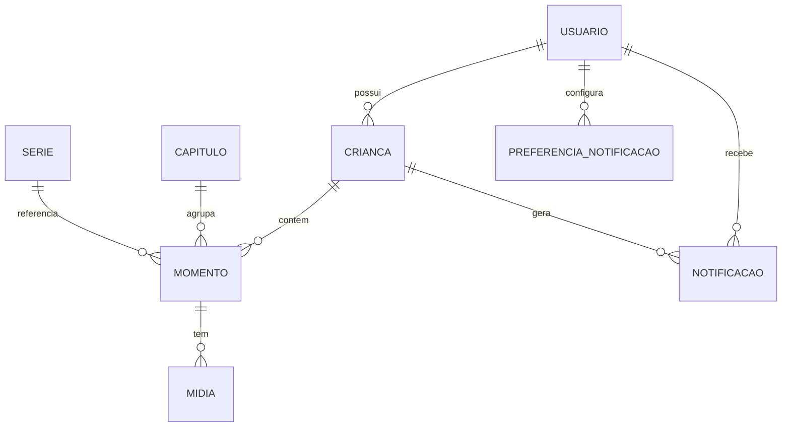

# 📘 Livro do Bebê — Visão Geral do Projeto

O **Livro do Bebê** é um álbum digital interativo que reúne memórias, marcos e cuidados do início da vida de uma criança. O projeto contempla **frontend (React + Vite)** e **backend (Python + FastAPI)** trabalhando em conjunto para entregar uma experiência completa — da captura de momentos à gestão segura dos dados.

---

## 🧭 Índice

- [Frontend (React + Vite)](#-frontend-react--vite)
  - [Visão geral do app](#-visão-geral-do-app)
  - [Telas principais](#-telas-principais)
  - [Dados simulados e persistência](#-dados-simulados-e-persistência)
  - [Stack técnica](#-stack-técnica)
  - [Como rodar o frontend](#-como-rodar-o-frontend)
  - [Estrutura do projeto (frontend)](#-estrutura-do-projeto-frontend)
  - [Design system e acessibilidade](#-design-system-e-acessibilidade)
  - [Recursos úteis do frontend](#-recursos-úteis-do-frontend)
- [Backend (Python + FastAPI)](#-backend-python--fastapi)
  - [Visão Geral](#-visão-geral)
  - [Stack Técnica](#-stack-técnica-1)
  - [Estrutura de Pastas](#-estrutura-de-pastas)
  - [Modelo de Dados Relacional](#-modelo-de-dados-relacional)
  - [Relacionamentos](#-relacionamentos-diagrama-mermaid)
  - [Execução local do backend](#-execução-local-do-backend)
  - [Comandos úteis](#-comandos-úteis)
  - [Segurança e privacidade](#-segurança-e-privacidade)
  - [Exportação](#-exportação)
  - [Enumerações principais](#-enumerações-principais-apputilsenumspy)
  - [API Endpoints (exemplo)](#-api-endpoints-exemplo-resumido)
  - [Contribuição](#-contribuição)
- [Licença](#-licença)

---

## 🎨 Frontend (React + Vite)

### ✨ Visão geral do app

- **Navegação de múltiplos níveis** com animações (Home → Galeria → Capítulos → Detalhes → Formulários), controlada pelo stack de telas em `App.tsx`.
- **Placeholders guiados por idade** que sugerem registros relevantes por capítulo e acompanham o progresso do álbum.
- **Formulários completos de momentos** com validações, tags, privacidade e persistência local (draft/publicado).
- **Painéis de saúde e bem-estar** para crescimento, vacinas e sono & humor, incluindo gráficos com Recharts.
- **Árvore da família e detalhes de membros** para conectar pessoas aos momentos registrados.
- **Experiência local-first**: dados de exemplo são carregados e persistidos via `localStorage`, permitindo testar o fluxo completo sem backend.

### 🧭 Telas principais

| Tela                      | Destaques                                                                                                                                 |
| ------------------------- | ----------------------------------------------------------------------------------------------------------------------------------------- |
| **Home**                  | Seleção de bebê, cards de progresso (crescimento, vacinas, sono, família) e atalhos para capítulos e marcos próximos.                     |
| **Galeria**               | Feed agrupado por mês, filtros por capítulo/período/mídia e cards com notas, tags e indicadores de privacidade/vídeo.                     |
| **Capítulos**             | Lista de capítulos com progresso por placeholder, acesso ao detalhe e abertura do formulário de novo momento.                             |
| **Detalhes do capítulo**  | Placeholders filtrados por status (todos/preenchidos/pendentes) e acesso direto ao formulário.                                            |
| **Formulário de momento** | Upload de mídia (placeholder), campos obrigatórios, cálculo automático de idade, tags, privacidade e ações (salvar, rascunho, descartar). |
| **Saúde**                 | Telas de Crescimento, Vacinas e Sono & Humor com gráficos, estatísticas e cadastros adicionais.                                           |
| **Família**               | Árvore genealógica, cartões de parentes e detalhe com momentos relacionados.                                                              |
| **Perfil & Notificações** | Preferências, estatísticas gerais, toasts e lista de alertas simulados.                                                                   |

> 📄 Consulte `src/FEATURES.md` para a lista completa e detalhada de funcionalidades já implementadas e ideias futuras.

### 💾 Dados simulados e persistência

- `src/lib/mockData.ts` reúne os tipos, dados base e operações CRUD (`getMoments`, `addMoment`, `updateMoment`, `deleteMoment`).
- Funções utilitárias calculam idade, progresso de capítulos e métricas (vacinas, sono, crescimento etc.).
- O estado é carregado uma vez na inicialização e sincronizado no `localStorage`, permitindo uma experiência realista offline-first.

### 🛠️ Stack técnica

| Camada         | Tecnologias                                                                                                     |
| -------------- | --------------------------------------------------------------------------------------------------------------- |
| Build & Dev    | Vite 6 com plugin React SWC                                                                                     |
| Framework      | React 18 + TypeScript                                                                                           |
| UI             | Radix UI / shadcn components, Motion para animações, Sonner para toasts                                         |
| Gráficos       | Recharts                                                                                                        |
| Estado & Dados | Hooks locais + utilitários em `lib/mockData.ts` com persistência `localStorage`                                 |
| Estilos        | CSS utilitário com tokens próprios em `src/styles/globals.css` e classes utilitárias geradas em `src/index.css` |

### ▶️ Como rodar o frontend

1. **Pré-requisitos:** Node.js 20+ e npm (ou pnpm/yarn, se preferir).
2. Instale as dependências:
   ```bash
   npm install
   ```
3. Suba o servidor de desenvolvimento:
   ```bash
   npm run dev
   ```
   O Vite abrirá em `http://localhost:3000`.
4. Para gerar o build de produção:
   ```bash
   npm run build
   ```

### 📁 Estrutura do projeto (frontend)

```
src/
├── App.tsx                # Stack de navegação e telas principais
├── main.tsx               # Bootstrap da aplicação
├── index.css              # Saída de utilitários (gerada via design system)
├── styles/globals.css     # Tokens, cores e temas (light/dark)
├── lib/
│   ├─ mockData.ts        # Tipos, dados mock e funções de persistência
│   └── theme-context.tsx  # Alternância de tema light/dark
├── components/
│   ├── home/, gallery/, chapters/, moments/, health/, family/
│   ├── layout/BottomNav.tsx        # Navegação inferior mobile-first
│   ├── ui/                 # Biblioteca de componentes base (buttons, inputs, etc.)
│   └── shared/             # Cards, listas, avatares reutilizáveis
└── FEATURES.md            # Documentação detalhada das funcionalidades
```

### 🎨 Design system e acessibilidade

- Tokens de cor, tipografia e espaçamento definidos em `src/styles/globals.css` com suporte a tema claro/escuro.
- Componentes reutilizáveis (`components/ui`) seguem padrões de toque mínimo (≥44px) e estados de foco para acessibilidade.
- Animações suaves com Motion (`motion/react`) e feedback visual via Sonner (`Toaster` em `App.tsx`).
- Attributions e licenças complementares documentadas em `src/Attributions.md`.

### 📚 Recursos úteis do frontend

- `src/FEATURES.md` — roadmap e checklist de funcionalidades.
- `src/guidelines/Guidelines.md` — espaço reservado para futuras normas de design e código.
- `src/Attributions.md` — créditos de componentes e imagens.

---

## ⚙️ Backend (Python + FastAPI)

### 🌟 Visão Geral

- **Tudo é um Momento:** cada lembrança, foto, vacina, ou momento em branco é um registro unificado.
- **Capítulos:** agrupam momentos por tema (Nascimento, Saúde, Família, Mêsversários etc).
- **Galeria:** exibe a linha do tempo visual de todas as mídias.
- **Séries:** controlam eventos recorrentes (ex.: Mêsversário, Consultas).
- **Notificações Inteligentes:** avisos automáticos por idade, vacinas, marcos e retroativos.
- **Privacidade:** controle granular (privado / pessoas / link).
- **Exportação:** gera PDF ou álbum físico.
- **Retroatividade:** registros antigos com cálculo automático da idade e reorganização do feed.

### ⚙️ Stack Técnica

| Camada                  | Tecnologia              | Descrição                                       |
| ----------------------- | ----------------------- | ----------------------------------------------- |
| **Linguagem**           | Python 3.11+            | Base do backend                                 |
| **Framework Web**       | FastAPI                 | APIs REST assíncronas e documentadas            |
| **Banco de Dados**      | PostgreSQL              | Estrutura relacional e JSONB para flexibilidade |
| **ORM**                 | SQLAlchemy + Alembic    | ORM robusto e migrações versionadas             |
| **Autenticação**        | JWT + OAuth2            | Sessões seguras e refresh tokens                |
| **Storage de mídias**   | AWS S3 / MinIO          | Upload seguro com URLs assinadas                |
| **Tarefas assíncronas** | Celery + Redis          | Envio de notificações, PDF, backups             |
| **Cache e fila**        | Redis                   | Cache de consultas e fila de jobs               |
| **Exportação PDF**      | ReportLab               | Geração de álbuns e relatórios                  |
| **Logs e tracing**      | Loguru + OpenTelemetry  | Observabilidade e monitoramento                 |
| **Infraestrutura**      | Docker + Docker Compose | Ambientes isolados                              |
| **Testes**              | Pytest + Coverage       | Testes unitários e integração                   |

### 🧱 Estrutura de Pastas

```
backend/
├── app/
│   ├── api/
│   │   └── v1/
│   │       ├── routes/
│   │       │   ├── momentos.py
│   │       │   ├── capitulos.py
│   │       │   ├── series.py
│   │       │   ├── notificacoes.py
│   │       │   ├── usuarios.py
│   │       │   ├── criancas.py
│   │       │   └── midias.py
│   │       └── schemas/
│   │           ├── momento.py
│   │           ├── capitulo.py
│   │           ├── serie.py
│   │           ├── notificacao.py
│   │           ├── usuario.py
│   │           ├── crianca.py
│   │           └── midia.py
│   ├── core/
│   │   ├── config.py
│   │   ├── security.py
│   │   └── settings.py
│   ├── db/
│   │   ├── base.py
│   │   ├── session.py
│   │   ├── migrations/
│   │   └── init_db.py
│   ├── models/
│   │   ├── momento.py
│   │   ├── capitulo.py
│   │   ├── serie.py
│   │   ├── notificacao.py
│   │   ├── usuario.py
│   │   ├── crianca.py
│   │   └── midia.py
│   ├── services/
│   │   ├── notificacoes.py
│   │   ├── exportacao_pdf.py
│   │   ├── calculo_idade.py
│   │   ├── storage_s3.py
│   │   └── series_scheduler.py
│   ├── workers/
│   │   ├── celery_app.py
│   │   └── tarefas.py
│   ├── utils/
│   │   ├── enums.py
│   │   ├── validators.py
│   │   ├── email.py
│   │   └── formatter.py
│   ├── tests/
│   └── main.py
├── docker-compose.yml
├── Dockerfile
├── alembic.ini
├── requirements.txt
└── README.md
```

### 🧠 Modelo de Dados Relacional

#### 🧒 Tabela `usuarios`

Armazena informações de autenticação e preferências.

| Campo          | Tipo              | Descrição                                  |
| -------------- | ----------------- | ------------------------------------------ |
| `id`           | UUID              | Identificador único                        |
| `nome`         | String            | Nome completo                              |
| `email`        | String            | Único                                      |
| `senha_hash`   | String            | Hash da senha                              |
| `foto_url`     | String (opcional) | Avatar                                     |
| `preferencias` | JSONB             | Configurações (tema, idioma, notificações) |
| `criado_em`    | DateTime          | Registro                                   |

#### 👶 Tabela `criancas`

Representa o bebê monitorado no app.

| Campo             | Tipo                                   | Descrição                  |
| ----------------- | -------------------------------------- | -------------------------- |
| `id`              | UUID                                   | Identificador              |
| `usuario_id`      | UUID (FK)                              | Responsável                |
| `nome`            | String                                 | Nome do bebê               |
| `data_nascimento` | Date                                   | Base para cálculo da idade |
| `genero`          | Enum(`feminino`, `masculino`, `outro`) | Gênero                     |
| `foto_url`        | String                                 | Avatar                     |
| `cidade`          | String                                 | Localização                |
| `dados_extras`    | JSONB                                  | Campos opcionais           |
| `criado_em`       | DateTime                               | Registro                   |

#### 🧩 Tabela `capitulos`

Organiza momentos por tema e estrutura narrativa.

| Campo       | Tipo                                                       | Descrição                          |
| ----------- | ---------------------------------------------------------- | ---------------------------------- |
| `id`        | UUID                                                       | Identificador                      |
| `nome`      | String                                                     | Nome do capítulo                   |
| `descricao` | String                                                     | Texto curto                        |
| `icone`     | String                                                     | Ícone ilustrativo                  |
| `viewer`    | Enum(`grid`, `timeline`, `checklist`, `series`, `gallery`) | Visual padrão                      |
| `filtros`   | JSONB                                                      | Tipos, subtipos, tags e marcadores |
| `ordem`     | Int                                                        | Ordenação                          |
| `ativo`     | Boolean                                                    | Status                             |
| `criado_em` | DateTime                                                   | Registro                           |

#### 📸 Tabela `midias`

Mídias (fotos e vídeos) associadas a momentos.

| Campo        | Tipo                  | Descrição                         |
| ------------ | --------------------- | --------------------------------- |
| `id`         | UUID                  | Identificador                     |
| `momento_id` | UUID (FK)             | Momento dono da mídia             |
| `tipo`       | Enum(`foto`, `video`) | Tipo de mídia                     |
| `url`        | String                | URL pública/assinada              |
| `thumb`      | String                | Miniatura                         |
| `duracao`    | Int (opcional)        | Duração (vídeo)                   |
| `meta`       | JSONB                 | Metadados (EXIF, resolução, etc.) |
| `criado_em`  | DateTime              | Registro                          |

#### 📝 Tabela `momentos`

Registros individuais — o coração do app.

| Campo             | Tipo                                                                                      | Descrição                             |
| ----------------- | ----------------------------------------------------------------------------------------- | ------------------------------------- |
| `id`              | UUID                                                                                      | Identificador                         |
| `crianca_id`      | UUID (FK)                                                                                 | Criança associada                     |
| `capitulo_id`     | UUID (FK)                                                                                 | Capítulo pertencente                  |
| `serie_id`        | UUID (FK opcional)                                                                        | Série associada                       |
| `tipo`            | Enum(`nota`, `foto`, `video`, `vacina`, `consulta`, `marco`, `carta`, `visita`, `custom`) | Tipo                                  |
| `subtipo`         | String                                                                                    | Ex.: “Primeiro Banho”, “Pentavalente” |
| `titulo`          | String                                                                                    | Nome do momento                       |
| `texto_curto`     | String                                                                                    | Resumo                                |
| `texto_longo`     | Text                                                                                      | Detalhes                              |
| `data_evento`     | DateTime                                                                                  | Data real do evento                   |
| `idade_calculada` | String                                                                                    | Ex.: “7m 4d”                          |
| `local`           | String                                                                                    | Local                                 |
| `pessoas`         | JSONB                                                                                     | Lista de pessoas envolvidas           |
| `privacidade`     | Enum(`privado`, `pessoas`, `link`)                                                        | Escopo de visibilidade                |
| `tags`            | Array[String]                                                                             | Etiquetas livres                      |
| `status`          | Enum(`rascunho`, `publicado`)                                                             | Estado atual                          |
| `midias`          | Rel.                                                                                      | Lista de mídias                       |
| `criado_em`       | DateTime                                                                                  | Registro                              |
| `atualizado_em`   | DateTime                                                                                  | Última atualização                    |

#### 🔁 Tabela `series`

Controla eventos recorrentes (ex.: Mêsversário, Consulta, Cartas).

| Campo               | Tipo        | Descrição                  |
| ------------------- | ----------- | -------------------------- |
| `id`                | UUID        | Identificador              |
| `crianca_id`        | UUID        | Referência ao bebê         |
| `nome`              | String      | Nome da série              |
| `regra_recorrencia` | String      | Ex.: “todo dia 12”         |
| `ocorrencias`       | Array[Date] | Datas previstas            |
| `progresso`         | JSONB       | `{preenchidas, pendentes}` |
| `ativo`             | Boolean     | Status                     |
| `criado_em`         | DateTime    | Registro                   |

#### 🔔 Tabela `notificacoes`

Gerencia o sistema de lembretes inteligentes.

| Campo           | Tipo                                                                      | Descrição                                             |
| --------------- | ------------------------------------------------------------------------- | ----------------------------------------------------- |
| `id`            | UUID                                                                      | Identificador                                         |
| `usuario_id`    | UUID                                                                      | Usuário dono                                          |
| `crianca_id`    | UUID                                                                      | Criança relacionada                                   |
| `tipo`          | Enum(`mesversario`, `vacina`, `marco`, `retroativo`, `digest`, `sistema`) | Tipo de evento                                        |
| `titulo`        | String                                                                    | Ex.: “Vacina de 6 meses”                              |
| `mensagem`      | Text                                                                      | Texto do alerta                                       |
| `estado`        | Enum(`pendente`, `enviado`, `lido`, `resolvido`)                          | Status                                                |
| `data_agendada` | DateTime                                                                  | Envio previsto                                        |
| `acao`          | JSONB                                                                     | Contexto de ação (link p/ formulário, capítulo, etc.) |
| `criado_em`     | DateTime                                                                  | Registro                                              |

#### 🧠 Tabela `preferencias_notificacao`

Guarda as preferências individuais do usuário.

| Campo             | Tipo                                            | Descrição                                      |
| ----------------- | ----------------------------------------------- | ---------------------------------------------- |
| `id`              | UUID                                            | Identificador                                  |
| `usuario_id`      | UUID (FK)                                       | Dono                                           |
| `frequencia`      | Enum(`imediato`, `diario`, `semanal`, `mensal`) | Freq.                                          |
| `silencio_inicio` | Time                                            | Início do horário silencioso                   |
| `silencio_fim`    | Time                                            | Fim do horário silencioso                      |
| `categorias`      | JSONB                                           | `{vacinas: true, marcos: false, digest: true}` |
| `criado_em`       | DateTime                                        | Registro                                       |

### 🧩 Relacionamentos (diagrama Mermaid)



### 🚀 Execução local do backend

```bash
# 1. Clonar o repositório
git clone https://github.com/seuusuario/livro-do-bebe-backend.git
cd livro-do-bebe-backend

# 2. Criar e ativar ambiente virtual
python3 -m venv venv
source venv/bin/activate

# 3. Instalar dependências
pip install -r requirements.txt

# 4. Configurar variáveis de ambiente (.env)
cp .env.example .env

# 5. Rodar localmente
uvicorn app.main:app --reload

# 6. Documentação
http://localhost:8000/docs
```

### 🧰 Comandos úteis

```bash
# Testes
pytest -v --cov=app

# Migrações
alembic revision --autogenerate -m "nova_tabela"
alembic upgrade head

# Worker Celery
celery -A app.workers.celery_app worker --loglevel=info

# Scheduler de notificações
celery -A app.workers.celery_app beat --loglevel=info

# Build Docker
docker-compose up --build
```

### 🔒 Segurança e privacidade

- **LGPD-first:** todos os dados do bebê são privados por padrão.
- URLs de mídia com **assinatura temporária (S3)**.
- Tokens JWT curtos + refresh automático.
- Criptografia (Fernet) para dados sensíveis.
- Logs anônimos para auditoria.
- Opção de exportação e exclusão completa de dados.

### 📦 Exportação

- PDFs gerados com ReportLab, utilizando templates infantis.
- Exportação possível por:
  - Capítulo
  - Série (ex.: todos os mêsversários)
  - Álbum completo (0–24 meses)

### 🧮 Enumerações principais (`app/utils/enums.py`)

```python
class TipoMomento(str, Enum):
    nota = "nota"
    foto = "foto"
    video = "video"
    vacina = "vacina"
    consulta = "consulta"
    marco = "marco"
    carta = "carta"
    visita = "visita"
    custom = "custom"

class Privacidade(str, Enum):
    privado = "privado"
    pessoas = "pessoas"
    link = "link"

class EstadoMomento(str, Enum):
    rascunho = "rascunho"
    publicado = "publicado"

class TipoNotificacao(str, Enum):
    mesversario = "mesversario"
    vacina = "vacina"
    marco = "marco"
    retroativo = "retroativo"
    digest = "digest"
    sistema = "sistema"
```

### 🧭 API Endpoints (exemplo resumido)

| Método                       | Rota                        | Descrição |
| ---------------------------- | --------------------------- | --------- |
| `POST /v1/auth/login`        | Login com JWT               |           |
| `GET /v1/capitulos`          | Lista de capítulos          |           |
| `GET /v1/momentos`           | Lista de momentos filtrados |           |
| `POST /v1/momentos`          | Cria um novo momento        |           |
| `PUT /v1/momentos/{id}`      | Atualiza um momento         |           |
| `DELETE /v1/momentos/{id}`   | Exclui um momento           |           |
| `GET /v1/notificacoes`       | Central de notificações     |           |
| `POST /v1/midias/upload-url` | Gera URL assinada de upload |           |
| `GET /v1/series/{id}`        | Detalhes de uma série       |           |

### 🤝 Contribuição

1. Crie uma branch: `feature/nome-da-feature`
2. Mantenha **tipagem completa (mypy)** e **lint (black, isort)**
3. Escreva testes unitários (pytest)
4. Abra um Pull Request descritivo

---

## 📄 Licença

MIT © 2025 — **Livro do Bebê**

> “Cada memória é um momento salvo no tempo — e aqui o tempo tem backup.”
